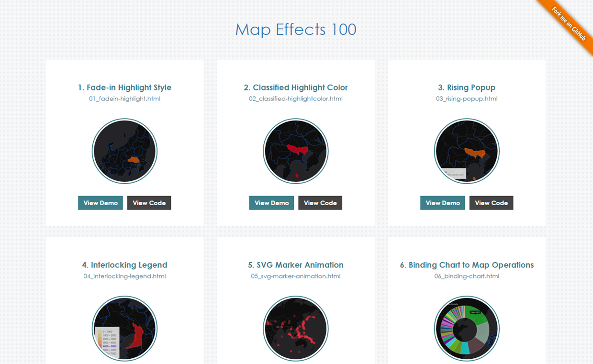

# Map Effects 100

[](https://gitter.im/muxlab/map-effects-100?utm_source=badge&utm_medium=badge&utm_campaign=pr-badge&utm_content=badge)

[](http://badge.fury.io/bo/badges)



[__Map Effects 100__](http://muxlab.github.io/map-effects-100/) has cool tips to design UI/UX on your Map.

### Map?

* [Leaflet](http://leafletjs.com/)

### Quick Start

```
bower install map-effects-100
```

## Index

[__Main page__](http://muxlab.github.io/map-effects-100/)

1. [Fade-in Highlight Style](http://muxlab.github.io/map-effects-100/Leaflet/01_fadein-highlight.html)
* [Classified Highlight Color](http://muxlab.github.io/map-effects-100/Leaflet/02_classified-highlightcolor.html)
* [Rising Popup](http://muxlab.github.io/map-effects-100/Leaflet/03_rising-popup.html)
* [Interlocking Legend](http://muxlab.github.io/map-effects-100/Leaflet/04_interlocking-legend.html)
* [SVG Marker Animation](http://muxlab.github.io/map-effects-100/Leaflet/05_svg-marker-animation.html)
* [Binding Chart to Map Operations](http://muxlab.github.io/map-effects-100/Leaflet/06_binding-chart.html)
* [Raphael Animation](http://muxlab.github.io/map-effects-100/Leaflet/07_raphael-animation.html)
* [Time Animation Play](http://muxlab.github.io/map-effects-100/Leaflet/08_time-animation.html)
* [Search Nearest with Turf](http://muxlab.github.io/map-effects-100/Leaflet/09_nearest-with-turf.html)
* [Hex Grid with Turf](http://muxlab.github.io/map-effects-100/Leaflet/10_hex-grid-with-turf.html)
* [Container Scroll Driven Map Navigation](http://muxlab.github.io/map-effects-100/Leaflet/11_scroll-driven-map-navigation.html)
* [Map Driven Container Scroll Navigation](http://muxlab.github.io/map-effects-100/Leaflet/12_map-driven-scroll-navigation.html)
* [Social Media Avatar on Map](http://muxlab.github.io/map-effects-100/Leaflet/13_avatar-icon.html)
* [Custom Popup with D3](http://muxlab.github.io/map-effects-100/Leaflet/14_custom-popup.html)
* [SVG Border Line Generation](http://muxlab.github.io/map-effects-100/Leaflet/15_svg-border-generation.html)
* [Responsive Popup with Picture](http://muxlab.github.io/map-effects-100/Leaflet/16_responsive-popup.html)
* [Map on Video](http://muxlab.github.io/map-effects-100/Leaflet/17_map-on-video.html)
* [ZINE for Map](http://muxlab.github.io/map-effects-100/Leaflet/18_interactive-zine-for-map.html)
* [Transforming Marker into Picure Frame](http://muxlab.github.io/map-effects-100/Leaflet/19_transforming-marker-into-frame.html)
* [Bouncing Popup](http://muxlab.github.io/map-effects-100/Leaflet/20_bouncing-popup.html)

Key code snipets of each file is [here](CODESNIPETS.md)!

...Feel free to come with us :octocat: :octocat: :octocat:

## Library & Leaflet Plugin

__Library__
* [jQuery](https://jquery.com/)
* [jQuery UI](https://jqueryui.com/)
* [D3](http://d3js.org/)
* [Chart.js](http://www.chartjs.org/)
* [Turf](http://turfjs.org/)

__CSS__
* [Font Awesome](http://fortawesome.github.io/Font-Awesome/)

__Leaflet Plugin__
* [Leaflet.RaphaelLayer](http://dynmeth.github.io/RaphaelLayer/)

## Contribution

You can join the project with the GitHub flow (Fork & Pull Request) in accordance with [CONTRIBUTING](https://github.com/muxlab/map-effects-100/blob/gh-pages/CONTRIBUTING.md) or propose your ideas at [Issues](https://github.com/muxlab/map-effects-100/issues).

## Licensing

Copyright 2015 MUX Lab.

MIT.
